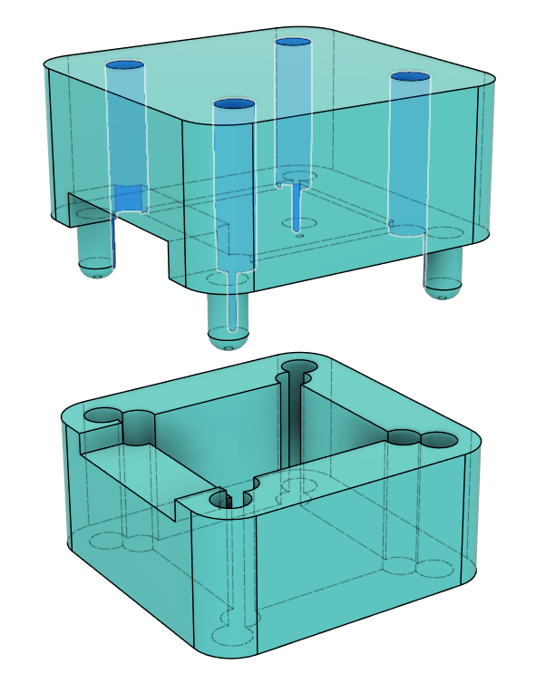

# FOC Ears: Dead Silent Animatronics, a Prototype

This repository documents my work to create truly silent animatronic cat ears.

The classic design using RC airplane servos is quite noisy, and I wanted to fix that to build animatronics that you can comfortably hold a conversation around.

## Table of Contents

- [FOC Ears: Dead Silent Animatronics, a Prototype](#foc-ears-dead-silent-animatronics-a-prototype)
  - [Table of Contents](#table-of-contents)
  - [Status](#status)
    - [Future Plans](#future-plans)
  - [Documentation](#documentation)
    - [System Overview](#system-overview)
      - [Components](#components)
      - [Motor Assembly](#motor-assembly)
    - [Wiring](#wiring)
    - [3D Prints and Mounting](#3d-prints-and-mounting)
    - [Misc. Lessons Learned](#misc-lessons-learned)
  - [Thanks](#thanks)
  - [Finally](#finally)

## Status

I managed to create a working prototype in time for GPN23. It has a rather bulky perfboard electronics package and several electronic design limitations, such as the lack of a fuse, but it held up well for the entire event. Unfortunately, my phone died between building the prototype and writing this documentation, so I have lost some work-in-progress photographs. Words and renders will have to suffice.

More Pictures (expand)

### Future Plans

I plan to develop a more robust version with a printed circuit board between the ears to house the electronics in a much neater way. I would like to eventually create a product out of this development, but even if I do, I plan to keep all design files and details open source.

## Documentation

> [!IMPORTANT]
> **This is a prototype**. I am documenting this for sake of posterity. If you wish to replicate this design, you are welcome to do so. However, expect to face issues, poor design decisions and have expect to solve many stupid problems on your own. Because of this, this is not written as a tutorial, but more as an overview of what it takes. That said, I'm happy to help where I can, just leave an issue on the repo here. 

With that said, lets get into it

### System Overview

#### Components

The system consists of the following components:

- An [ESP32WROOM](https://aliexpress.com/item/1005008002597306.html) micro controller  

- Two [SimpleFOC mini](https://docs.simplefoc.com/simplefocmini) driver boards  

- Two [Mitoot 2208 100kv](https://aliexpress.com/item/1005006008489660.html) Brushless Gimbal Motors  

- Two [MT6701qt](https://aliexpress.com/item/1005007349429583.html) Magnetic Encoders  

- A [BNO055](https://aliexpress.com/item/1005006770124726.html) IMU  

- Ears from Aliexpress. There appears to be a whole range of different style ears on Aliexpress, all following the same basic design. Look for the ears in the ~10€ price class, those will likely be extremely similar to [the ones I used](https://aliexpress.com/item/1005004647818937.html).  

- A generic 3.3V Regulator (must be 15V capable)
- A generic configurable USB-C PD trigger board (prototype used 15V)
- A generic USB-C PD capable Power Bank (in my case 100W 20V capable)

Total cost exluding the power bank comes out to ~53€.

Images were taken from their respective linked pages.

> [!NOTE]
> The hardware choices I made worked, but were not ideal:
> 
> - The ESP32 can not be flashed without having to hold down the boot button every time
> - The Motors come with the wire through their hub, so one needs to depin the connector, pull the cable through and add the pins again.
> - The Motors are also a bit large, smaller probably works but untested.
> - The Encoder board is undocumented, had to be reverse engineered with the chip data sheet
> - The BNO055 has some hardware issues and is also discontinued, but it was the board I had laying around.

#### Motor Assembly

The motor and encoder are mounted together by a stack of parts that clamps the two to each other and the assembly to the head band using all the same screws. The magnet for the encoder is held within the hollow motor shaft by a press fit 3d printed adapter. The ears are mounted on top with two M2x6 screws through the U channel piece.

Ordinarily this wouldn't work as the holes in the motor do not match the holes in the encoder PCB. However there is nothing vital in the ares of the encoder PCB where the holes are needed, so I devised a 3d printed drilling jig to create the required holes. Of course this technique is only applicable to the exact sensor board I used.

> [!CAUTION]
> Using too long screws to clamp the motor-encoder assembly together will destroy the motor. The holes do not have a backstop, so you will penetrate the coils with the screw. You will not feel rotational resistance as this happens as you are only hitting the stator. I used M2.5x8 screws.

The ears are mounted by making a cutout in them with flush cutters to fit the U channel piece, which is then glued into place with super glue. It is vital that this cut is deeper than the u channel such that the outer edges of the ear sit as flush as possible to the head band. The U channel does not extend all the way down as it would snag on the motor cables if it did.

Additionally, for secondary motion the lower ear lobe of each ear is mounted to a slider on the head band. This causes the ear to fold on rotation, which looks much more natural than the long ear lobe swinging backwards. This however has the issue that the aliexpress ears come with thick wire in them for posing, which would prevent this motion. The solution is as simple as it is ugly: fatigue cracking the wire every 5 or so mm with pliers within the area that should bend. The slider is printed from TPU for silent motion and (surprisingly) low friction.

> [!NOTE]
> I have tried to completely remove the wire from the ears. The wire is hot glued in place within the ears in multiple places, and the fur is bonded together firmly. Even by cutting along the edge of the ear all the way around I was not able to extract the wire in the base of the ear, and said cut looked quite ugly and would have been hard to close up again. Hence I deemed it better to leave the wire in place, but fatigue crack it where necessary. A less hand-fatiguing solution is definitely needed for higher volume production though.

The ear detached from the motor, with lines highlighting roughly where I broke the internal wire. Also visible is the TPU slider, here detached from the rail.

### Wiring

PowerPoint graphic design is my passion. Not pictured are 3.3v running to all sensors, shared ground between all and a 2.2k pullup resistor between SDA and 3.3V on the BNO055. Additionally, note that I used SimpleFOC Mini 1.0 driver boards as they were easily available on Aliexpress. SimpleFOC Mini 1.1 drivers are similar, but their pin order appears to be flipped.

Here's the reverse-engineered diagram for the encoder. Also, [here's the datasheet](https://uploadcdn.oneyac.com/attachments/files/brand_pdf/magntek/F3/CA/MT6701QT-STD.pdf).

> [!NOTE]
> This encoder is supposedly capable of I2C and SSI (we use SSI), and CS would toggle between the two modes. However this would cause bad I2C writes on the shared SSI bus with CS off, which I have heard reported, but could never observe myself. I can only assume my specific board has some resistors onboard that disable I2C.

A closeup of the final breadboard. Unsurprisingly, gluing circuit boards together edge to edge did not prove to be particularly sturdy, and the design made the USB-C cable start uncomftably low. But it did work.

### 3D Prints and Mounting

This is the mount for the board, based of my earlier design of ear hook glasses clips to mount non-animatronic ears. This glasses clip is desiged for my glasses (Zenni Optical [Navy Rectangle Glasses #2018916](https://www.zennioptical.com/p/tr-rectangle-eyeglass-frames/20189/2018916) ), so if these do not also happen to be your glasses you will have to devise a custom mounting solution. I am yet to come up with a generic solution that would work with all glasses while still looking good.

Also, this piece is a royal pain to print as one might expect. The first print of it I did completed, but all five attempts to print a spare piece before the event failed.

The parts constituting one motor-encoder-ear sandwich, laid out in the orientation I printed them in.

The ear lobe slider which glides on the metal headband. It is printed from TPU for silent motion. Earlier prototypes showed that even the slightest bit of noise so close to the wearer's ear is quite annoying.

All 3d printed parts can be found in the ``printed_parts`` directory as STEP files, as well as the original Fusion360 source files. Do note however that the source files are a royal mess as they were created during prototyping and with exactly zero patience.

### Misc. Lessons Learned

- If the screws clamping the encoder to the motor are not tight enough, the motor likes to shake itself to bits as it twisting against the encoder causes a feedback loop.
- If the screws clamping the encoder to the motor are too tight, they can stretch a poorly printed plastic clamp and make the mounting screws penetrate the motor core.
- Having a cheap oscilloscope ([Zoyi ZT-703S](https://aliexpress.com/item/1005006593085723.html), ~80€) was invaluable during development, you likely want one too.
- At least on my BNO055 board the I2C pullups were too weak for high frequencies, an external pullup was needed.
- Having a Dupont connector crimping tool is quite useful.
- Surprisingly, the mess of wires going from the sensors and motors to the perfboard never got tangled. Still, they're a bad design.
- Having any D term in the PID motion controllers makes the motor quite noisy.
- High loop speed of the main FOC loop is important for precise and silent control.
- Any change in loop speed also constitutes a change in optimal PID values, a fixed loop speed would be a good code design choice I did not make.
- A RP2040 has pretty low loop speed due to lack of a hardware floating point unit, not ideal for this application.
- Many in and output pins are needed to control the motors, 4 per motor driver, one per sensor plus two more sensor shared pins, plus the I2C pins for the IMU. I almost ran out of useable IO pins on the ESP32.
- Reading the IMU every loop slows the motor control loop down too much, reading the IMU every 10 ms was found to be sufficient.
- A PT1 filter element was integrated into the motor driver to limit maximum acceleration, safeguarding from a position step input being too violent.
- The clamping pieces should be printed from ASA or similar, especially during testing or with a sensor error, the motors can get quite hot.
- The metal hoop that comes with the aliexpress cat ears is bent outwards at the bottom. Bending it straight makes sliding mounts with much tighter tolerances on possible.
- Fatigue cracking the ears works, but likes to compress the fur under the pliers. Scratching it with finger nails appears to restore most of the fluff.
- Mounting the ears to my glasses proved essential. The motors are not the lightest, and with my mounting solution clipping onto my glasses and hooking behind my ears, I never feared losing the ears. I am yet to come up with a solution that would work for all glasses frames, let alone a solution for people who do not wear glasses.
- Espressif changed something in more recent versions of the framework, which broke SimpleFOC. It either doesn't compile or kernel panics. I went and found the newest version released before the latest SFOC release, which worked well. You can find the details in the platformio.ini file.
- SimpleFOC requires that PlatformIO ``lib_archive = false``. If it isn't your code will compile and run, but behave weirdly in all sorts of strange ways. Be careful.
- The Motors claim they can handle 12V, but I have driven them to 20V with no issues. I just went with 15V as I didn't need the torque and it slowed the motor heating up should an ear become blocked.
- This project started with me trying to use silent stepper drivers and motors for the motion instead of FOC. However, the holding current being constantly drawn by the stepper motors made them get very hot while still lacking torque to not miss steps. Still, using TMC2209 stepper drivers might work for smaller animatronics such as blinking eyes.

## Thanks

to everyone who helped me with this project. Especially the amazing people of the Voidstarlab and SimpleFOC discord who took their time to not only help me debug problems with my motor setup, but also with reverse engineering the Encoder PCB, debugging the IMU and many other hardware engineering issues unrelated to SFOC. This was my first true hardware engineering project. I learned a ton, and I couldn't have done it without y'all.

## Finally

Overengineer more silly projects, build cool stuff, and have fun!

